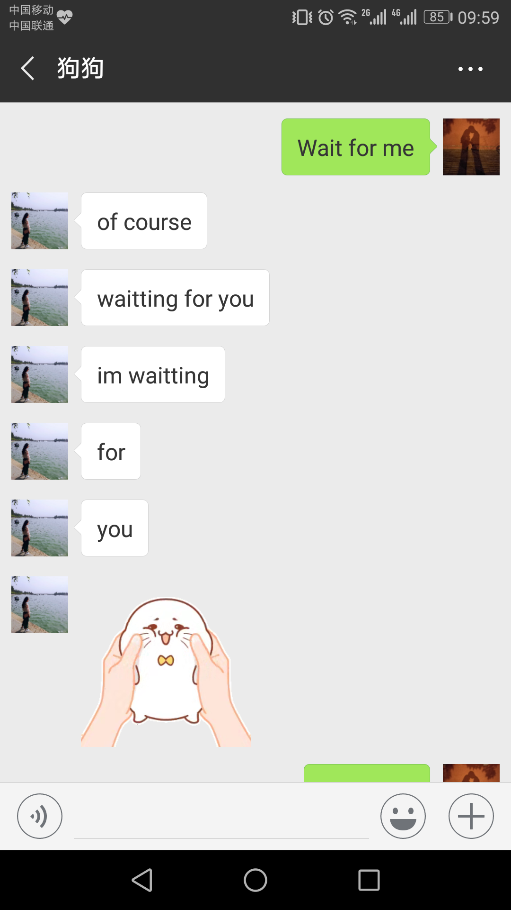

李诞火了，他的那句“人间不值得”，也跟着火了。

从我推荐你看《吐槽大会》，到你带着我看《奇葩说》，李诞始终是我们共同喜欢的那个人。他嬉笑怒骂，或插科打诨，在让你我开怀大笑的同时，总有那么几句话能叩到你我的心坎上。

今天是与你在一起后你的第十个生日，我掰着指头算了好几遍，确认无误后不禁感叹：时间过得真他妈快！理所应当又该到了朋友们口中的“每年一虐”环节，翻看着过往写给你的那些文章，记忆也随之跳跃飞扬。每每这时，我才更加深刻地体会到文字的意义。言语会随风飘散，而文字则真实存在，一次阅读，便是一次回味。我踏入过往的青葱岁月，抚摸着那些晶莹纯澈的情愫，生活逐渐将我们的感官变得坚韧，但你始终是我心底最柔软的那一块。

今年于我们似乎是有特殊意义的一年，你毕业回了南昌，我暂时仍在北京。记得在一次聊天中谈及我回去的时间，我当时并没有一个非常明确的答案，而你，却是异常坚定地给了我答案。

  

这让我想起曾经那个不太成熟的自己，得过且过不求上进，你一直伴我身旁待我成长。而今身处异地，你再次等我回家。于我而言，这大概就是最动听的情话了，**我懂它的珍贵，定会加倍珍惜**。

每天上下班的路上，我习惯带上耳机，听歌或是小说。最近恰好在听余华的《活着》，听老人福贵平淡地讲述着自己一生的悲喜，仿佛是在说别人的故事一样。度过了如此悲惨的一生，老人依然活着，并且愈加坚强洒脱。配合这样的故事，再看着后厂村路上车水马龙人来人往，某个瞬间我会突然有种不真实的感觉。老人的淡然与身旁的匆忙所形成的巨大反差强烈地冲击着我的内心，让我不得不去思考人生的意义。

国庆回家和几位老友小聚，酒过三巡，桌上的氛围就变得热烈了。大家借着醉意相互诉说着生活的不易，倾吐着心中的愤懑。在外漂泊的渴望能早日安定下来，留守家乡的希望能有更好的收入。这让我想起一道很现实的选择题：给你100万，你是选择在大城市的城郊付个首付，同时背上几百万的贷款，换来一个六七十平的小窝；还是选择在五六线小城全款买车买房，静静度过接下来的几十年？关乎大城市与小城市的讨论，一直是一个争执不下也永远不可能有结果的话题。大都市意味着更好的城市建设，更完善的配套设施，更先进的教育和医疗，更多的机会及更高的收入；而小城市则拥有更少的焦虑，更低的生活成本，更适宜的生态环境，更小的压力及更高的幸福指数......

好在我们已经做完这道题了，选择了适中的南昌，离家不至于太远，压力不至于太大，发展不至于太差。剩下的只需好好规划一下今后的生活。我喜欢和你一起畅想未来的日子，而你则尤其热衷于给孩子取名这一块。每每看到你想出的那些稀奇古怪的名字，我都在心里默默为孩子捏了一把汗......

  

前些天的一个下午，沉寂了许久的高中同学群里难得热闹了起来。而让大家津津乐道的话题仍然是房价。高昂的房价给我们这个年龄段的人带来了巨大的压力与焦虑，能靠自己买房的年轻人少之又少，网上所流传的“六个钱包”或许也是当前存在的普遍现象。今年年初，在父母们的帮助下，我们总算是把房子的事情落实了下来。记得你好几次和我吐槽房价太贵，你甚至感慨：养儿子真不容易，咱们以后还是生女儿吧。听到你说这些，我真的很感动。掏空父母一辈子的积蓄确实让我有些许不安，但我也有责任为你提供更好的生活条件，不能让你跟着我受苦。至于长辈们的恩情，也只有日后慢慢报答了。

或许是源于生活的压迫，现在的人们似乎越来越不相信爱情了。刷着知乎，首页上充斥着各种关于出轨或是家庭矛盾的问题，看客们的态度也各不相同。有的人怀着看热闹不嫌事大的心态，调侃着别人的不幸；有的人从他人的故事中看到了自己的影子，找寻到一点心理的平衡；有的人则庆幸自己没有处于这样的境地，暗自高兴的同时却又不免开始猜测怀疑......看过这林林总总的背叛与伤害，我感到自己是如此幸运，早早就遇到了你。我回想起去年冬天，你拉着我戴手套的手然后把手也插进我的手套里；回想起那个午后，你假装生气时翻着白眼扭头偷笑的傻样；回想着这段时间每天早上你都要给我发一张自拍臭美；回想着你善解人意的同时依然葆有的那份童真......于是我在一些满溢着感人爱情故事的问题下，情不自禁地写下了我们的故事。

  

有人说，成功的人生就是一连串的正确的选择。可我们谁也不是先知，我们只是平凡的普通人。面对生活中无数的岔路口，一个个的选择，意味着一个个的转折。它们都将改变我们生活的航道，前方可能云霓红艳，亦可能暴雨狂风。而当十年之前的我选择牵起你的手的时候，应该就是我今生所做出的最正确的选择了。只愿与你共同走过接下来的时光，其余不论发生什么，都能平静淡然地接受。

我想，对我来说，李诞的这句“人间不值得”还有后半句——**有你便值得**。

  

PS. 祝大宝贝生日快乐~

也没有准备啥像样的礼物，你总说喜欢看我写给你的文章，虽然好像写得越来越差了，不过只要你还愿意看，我就会一直写下去~