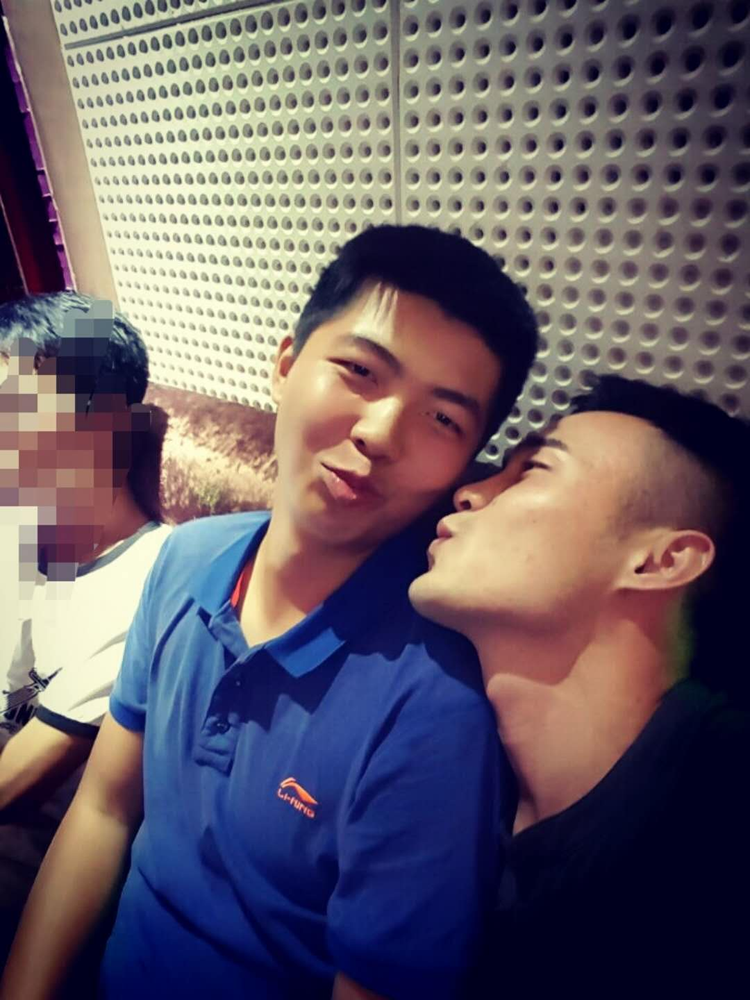

轻轻的 你走了

正如 你 轻轻的来

你挥一挥 衣袖

不带走 一片 祥云

坐在会议室里百无聊赖的我忽然间诗兴大发，一口气创作了这首有可能即将流传千古的《再别康鸡脖》，嘴角上扬，略为得意。

一想到你离开了世界500强之300多家子公司排名第一的这片沃土，我就不自觉的有些惆怅。不是为你的离去，而是为那莫名其妙继承下来的你的“遗产”——一根20M的网线，一个盆，一个桶，一个布衣柜以及若干衣架。曾经在有数个一同跑着步聊着理想的夜晚，你说我是一个三观很正的人。我很赞同你的观点，所以我不能白拿你这些东西，遂作此文，以资鼓励。

- 【一】

  子在川上曰：逝者如斯夫，不舍昼夜。

  这一年里，一直让我耿耿于怀的是，你竟凭借着一个名字，在新职工选秀大赛上力压帅气逼人的我成功上位，当选了组织委员。不过随着对你了解的加深，我逐渐改变了我最初的看法，你凭借的不仅仅是名字，还有那个名句。

  > 何以解忧，唯有杜康。

- 【二】

  八月的厦门是着了火的，草丛里的蚊子是着了魔的。

  相信你永远也不会忘记去年的那一天，孔老板带着我们去测临建场地坐标。当时天气正热，你我都是短裤短袖，一身清爽校园风。

  然而残酷的现实总会让年少无知孩子在不经意间收获惨痛的教训。需要测量的那块荒地长满了近一人高的野草，野草丛中居住了数以亿计的萌萌小生物，其中数蚊子最为热情。那是一种不请自来挥之不去的让人无可奈何生无可恋的热情啊，随便一个巴掌拍下去绝对能有收获，而且绝对不止一只。于是，负责扶棱镜的我在草丛中跳起了广场舞，导致测量迟迟没有进展。

  或许是天生流淌着英勇就义的血液，对讲机里，你提出要和我换一下，你来扶棱镜。

  我欣然接受。

  只见你大义凛然地屹立在草丛之中，手中的棱镜亦是丝毫不动，这不禁让我颇为讶异：“丫的这货什么血型，蚊子不咬他？”

  测量完成后，你拿着棱镜来和我们汇合，满脸悲壮。仅仅半个多小时，你的小腿已经比之前粗壮了一圈，包连着包，连成了一片肉色的海洋。

  那真是触目惊心。

  我知道，这个人情，我算是欠下了。现在，还没等我还，你就走了。遂作此文，以资鼓励。

- 【三】

  年初，公司团委干事竞聘，我们都去了，住的同一屋。

  由于准备时间仓促，竞聘的前一天夜里我们都还在修改演讲稿。历经了一天的颠簸，我实在是困的睁不开眼，便躺在床上闭目养神。

  你还对着稿子涂涂画画着，“祥云，你怎么不改？”

  “我在打腹稿。”

  “哦……”

  （第二天）

  “祥云，起那么早？”

  “对啊，起来改稿子，昨晚不小心睡着了。”

  “你不是打腹稿么，后来隔壁的声音你没听到吧？”

  “什么声音？”

  “嘿嘿嘿……”

  “我靠，你怎么不叫我？”

  “你说你在打腹稿啊！”

  “……”

  从那之后每次我要写点什么东西的时候，你都要拿“打腹稿”来嘲讽我。今天，我倒是真的没有打腹稿了。

- 【四】

  工地旁有一家麦当劳，每次去你都是同一个套路，中薯中可。

  又一次和你相约麦当劳，我觉得你长久以来的菜单有些干瘪无味，便问：“今天你能不能换换？”

  “嗯，可以啊。”你把声音提高了八度，用一种从未有过的自信对着服务员说道：“你好，给我来一份大薯加一份大可。”

  “我尼玛……”

  吃东西的时候总是要聊聊人生的。当我问及你的梦想，你说：“我要开豪车泡美女，让我爸妈过上好日子。”

  多么朴实无华的梦想啊！你不知道你说出这些话时浪荡嚣张的样子有多欠揍。这或许也是我们臭味相投的原因之一吧。我喜欢你这种赤裸裸的直白，远远好过那些满腔欲望却故作一副无欲无求姿态的伪君子。

  犹记得高中时的我在一次家长会上谈及梦想，“我要努力成为三种人，一个孝顺的儿子，一名优秀的丈夫，一位称职的父亲。”那似乎是我第一次在众人面前曝光我的梦想。当我用小学生朗读般的语气说完这些话时，腿都已经在打颤了。

  梦想似乎有些遥远，却必须要有的。

- 【五】

  你走的前一天晚上我说我要送你，微信问你几点出发，迟迟未收到回复。

  第二天一早，是我有生以来为数不多的几次在闹钟响之前自然醒，拿起手机，看到的是你几分钟之前回复的消息：

  已经走啦

  坐公交挤得很 就不用送了

  心意收到

  我茫茫然望向窗外，一句诗蓦地出现在脑海。山回路转不见君，雪上空留马行处。好你个康鸡脖，连个背影都不留给我。

  不知你在外的路会是怎样，不知你下一站会在哪里。我们都期望向生活的深处走去，美好的人生便是找准路，在逐步放弃中，逐步坚定。

  若干年后若再聚首，执手相看泪眼，我请你吃大薯大可。

  