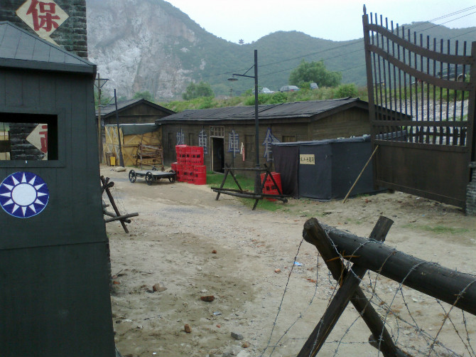
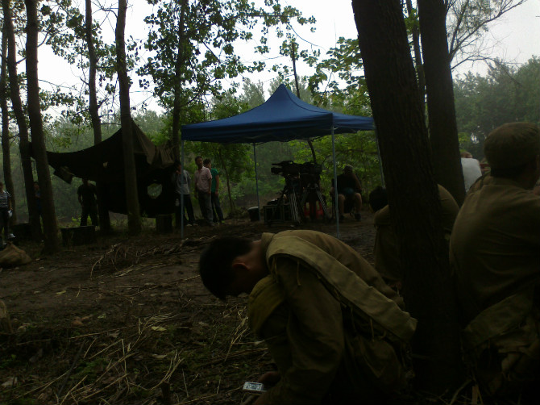

电视中的每一个镜头，都有可能要经过数遍的拍摄。不久前，我有幸亲身体验了一回演员生活。

我的家乡是彭泽，江西最北部的一个小县城，北濒长江，南抵鄱阳。今年七月，一批外地人的到访让这个原本平静的城镇小小地沸腾了一下。他们是来自北京的《连环套》摄制剧组，同行的有《新三国》中刘备的扮演者于和伟及其他一些影视明星。

由华谊兄弟公司投资拍摄的30集电视连续剧《连环套》讲述了国民政府时期国军在彭泽县马当镇阻击日军的故事，外景拍摄地主要选在了彭泽朝阳码头及马当炮台山。暑假在家的我得知了这一消息后，便与几个同学约好，一同去剧组当群众演员。

  

第一天起了个大早，因为据说应征群演的人很多，大都也和我们一样是毕业班的学生。毕竟一天下来可以挣得50块钱的出场费，这比呆在家里什么都不做要好得多。6点钟左右，我和几个同学便赶到了朝阳码头，此时就已有一些同学捷足先登了。剧组的人还没有来，但这里早已被他们布置好了：码头那装起了一道大门，木质的，却因为刷了黑漆而显得很有厚重感；门内侧建起了销售船票的屋子，屋子对面立起了一些那个时期的广告牌，广告牌下面则摆起了各种摊位；电线杆也被粉刷成了黑色，上面挂着一盏老式路灯。再往里就是军营了，从门口向内依次可以看到有铁丝栅栏，哨岗，架设炮，粮食仓库，弹药仓库及会议室等。会议室中还有一副模拟地形图那是我后来才知道的。

  

约莫过了10多分钟，剧组的车子开过来了，许多人便一拥而上，争抢着去报名。我混迹在人群当中，也侥幸搭上群众演员的末班车。

报完名，场务要求我们去换上戏服，五六十个人就赶去服装车那儿领取自己的服装。今天似乎拍的是难民戏，我们全都领到了破破烂烂的麻布衫和粗布裤。至于鞋子，则是让我们自己在地上那堆混着泥土的布鞋中去挑一双。放眼望去，大小不一、款式不同的鞋子几乎就没有能成对的。而凑近了，那散发出的味儿瞬间让我萌生了放弃演戏的想法！可斟酌了一番，我还是留了下来。裤子大了就找了根绳子绑着腰，鞋子大了就当拖鞋穿。衣服换好后我们被带到军营门前的空地上排队，不知是什么原因，场务突然通知要从我们中选取几个人饰演警察。或许是我在心里的祈祷奏效了，我被选了出来。当重新穿上干净的警察服的那一刻，我的心中真的是百感交集啊。

  

接下来的一上午拍的主要是难民聚在码头想买票上船却买不到票时所发生的一些事，而我，则是拿着警棍扛着枪在其中维护秩序。七月的天气很热，厚实的服装把我的身体闷得难受，但一想到可能有机会上镜，浑身又涌现出了用不完了力量。中午剧组包饭，伙食一般，现在只记得有个西红柿炒蛋了。下午警察基本没什么戏，我就和几位同事坐在阴凉处聊天。群众演员的工资是日结，晚上我回到家时已到了8点。算算今天差不多工作了14个小时，只能说演员确实也很辛苦。

  

次日，我又和几个同学一起奔赴码头。与昨天不同，我们今天被分派到炮台山拍戏。今天拍的是战争戏，我们饰演日本军。在经过一片小山丘时，我们乘坐的卡车遭到国军的伏击，所有人全部丧生。当然，跳卡车那种技术活是由武行的演员们完成的，我们群众演员就单单躺在地上装尸体。在我躺在地上的时候，听着耳边掠过一阵阵的风声，那是国军从我们身上跨过去呢，他们的脚偶尔也会让一些尘土掉落在我的脸上，这让我觉得很不爽。今天真实的目睹了影片中演员的血是怎样出来的，一个血袋连接着导线，导线的尽头是控制按钮，在演员们“中弹”的瞬间，他们按下手中的按钮，同时配合动作，就可以营造出很逼真的效果。

  

之后的几天，我又分别饰演了不同的角色。有国军，学生兵等等。印象最深的还是在一片树林中拍摄枪战的那一次。事前在树林中点燃一些干草制造烟雾，再进行国军与日军的激烈交火。其实，只有武行的演员在前边拿着真枪，我们都是在后边拿着道具摆姿势。那天还近距离接触了几名主演，他们的演技确实很高，可以在刹那之间进入角色。从树林中出来，我们来到江边冲锋，前边是真的炸弹爆炸，有浓浓的黑色烟雾。虽然并没有多大的危险，却也让我们前进的步伐不是那么稳健。这让导演很生气，他一遍又一遍要求我们要冲出气势，大概反复了五六遍，我们勉强达到了他的要求。

  

现在，我很期待这部电视剧的上映，虽然在其中不一定会看的到我。我想自己今后应该再不会与电视剧产生交集了，而这次跑龙套的经历，也将成为我一生的回忆。

  

